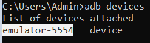
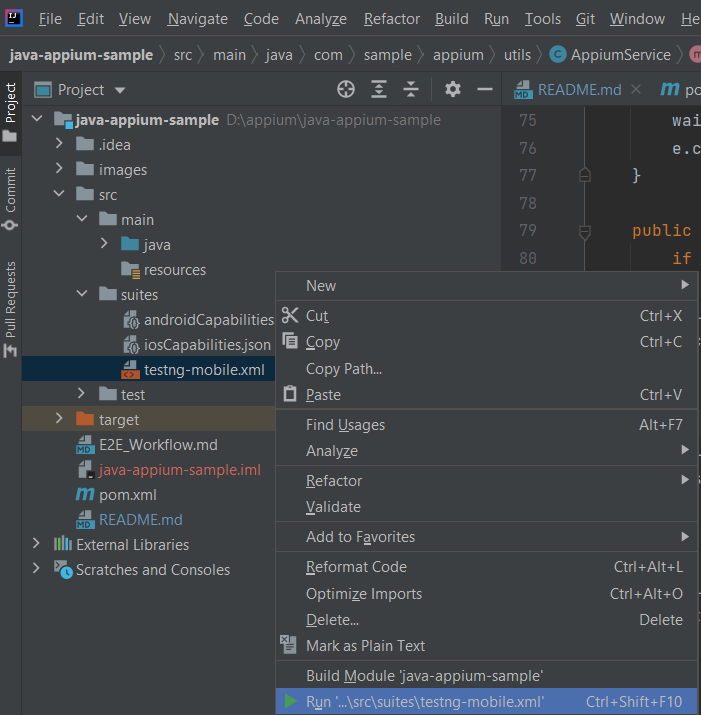

# Description
A simple Appium Java test scripts to test an native mobile application (Android & iOS)

Technologies/Tools used in this sample:
- Java - Programming language
- Maven - Build automation tool
- Appium - Automated mobile testing framework
- TestNG - Test Management library
- GitHub - Version control
- IntelliJ - IDE

# Automated Tests Workflow
[E2E_Workflow](./E2E_Workflow.md)

# Prerequisites
1.  Java Development Kit 8 or above [https://java.com/en/download/help/download_options.html]
2.  Maven [ http://maven.apache.org/install.html ]
3.  Appium
   - Appium server (via [npm](https://appium.io/docs/en/about-appium/getting-started/?lang=en) or [Desktop Application](https://github.com/appium/appium-desktop))
   - [Android Studio](https://developer.android.com/studio) for Android testing
   - [Xcode](https://developer.apple.com/xcode/) (MacOS) for iOS testing
4.  Git (optional) [ http://git-scm.com/downloads ]
5.  IDE (optional) [[eclipse](https://www.eclipse.org/downloads/), [vscode](https://code.visualstudio.com/download) or [IntelliJ](https://www.jetbrains.com/idea/)]
# Getting Started
## 1. Checkout source 
   - Download the zip source at https://github.com/lgjp-open-source/appium and extract it
   - Or use git command: 
   ```console
   $ git clone https://github.com/lgjp-open-source/appium.git
   ```
## 2. Run Android
### 2.1 Setup device
- Plugin your device (your device must [Enable developer options and USB debugging](https://developer.android.com/studio/debug/dev-options)) or start an Emulator ([command line](https://developer.android.com/studio/run/emulator-commandline) or [AVD Manager](https://developer.android.com/studio/run/emulator#runningemulator))
- Open console then run: ```adb devices``` and copy android device name

   

- Open /appium/java-appium-samplesrc/uites/androidCapabilities.json and replace "deviceName"'s value with copied value
- Open /appium/java-appium-samplesrc/suites/testng-mobile.xml and set "os" to "android" (\<parameter name="os" value="android"/>)
### 2.2 Start Appium Server
- Via [npm](https://appium.io/docs/en/about-appium/getting-started/?lang=en) or [Appium Desktop application]()
### 2.3 Run test
#### 2.3.1 Commandline
   ```console
   $ cd ./appium/java-appium-sample
   ```
   ```console
   $ mvn clean test
   ```
2.3.2 Or IntIntelliJ



## 3. Run iOS
### 3.1 Setup device
- Plugin your device (your device must [Enable developer options and USB debugging](https://developer.android.com/studio/debug/dev-options)) or start an Simulator ([command line](https://developer.android.com/studio/run/emulator-commandline) or [AVD Manager](https://developer.android.com/studio/run/emulator#runningemulator))
- Open /appium/java-appium-sample/src/suites/androidCapabilities.json and replace "uuid"'s value with your device's uuid ([How to get your iOS uuid]())
- Open /appium/java-appium-sample/src/suites/testng-mobile.xml and set "os" to "ios" (\<parameter name="os" value="ios"/>)
### 3.2 Start Appium Server
- Via [npm](https://appium.io/docs/en/about-appium/getting-started/?lang=en) or [Appium Desktop application]()
### 3.3 Run test
#### 3.3.1 Commandline
   ```console
   $ cd ./appium/java-appium-sample
   ```

   ```console
   $ mvn clean test
   ```
#### 3.3.2 Or IntIntelliJ


## 4. View test results
   Test results was generated at appium/java-appium-sample/target/surefire-reports/index.html

All steps are recorded in this following video:

- Android Emulator: https://youtu.be/E-ZQe3hvnQA
- iOS Simulator: https://youtu.be/E-ZQe3hvnQA